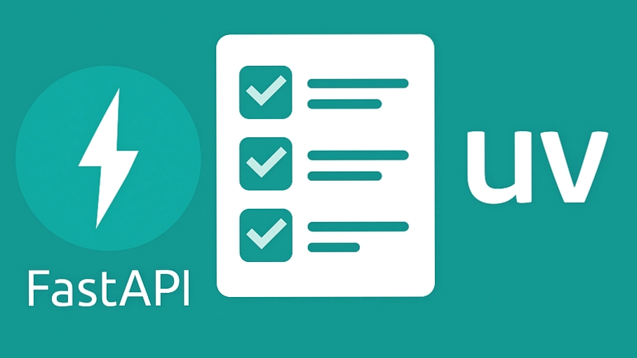

# ToDoApp 📝

<div align="center">
  
  <br/>
  <strong>A Modern, Fast, and Secure Task Management API & Web App</strong><br/>
  <em>Sürətli, Təhlükəsiz və Müasir Tapşırıqlar İdarəetmə Sistemi</em>
  <br/><br/>
  
  [](https://github.com/hamidmammadov/ToDoApp/releases)
  [](https://opensource.org/licenses/MIT)
  [](https://www.python.org/downloads/)
  [](https://fastapi.tiangolo.com)
</div>

---

## 🇺🇸 English Documentation

### 📌 Overview
ToDoApp is a full-stack, production-ready web application built with **FastAPI** and **Jinja2** templates. It features secure user authentication (JWT), robust task management features (CRUD), role-based access control (Admin/User), and an interactive web UI. The project uses SQLAlchemy for efficient database operations and SQLite (or PostgreSQL) as its database engine. It also supports Internationalization (i18n) for multiple languages.

### 🤖 Automated End-to-End Testing
The application has been thoroughly tested using an automated browser subagent to verify core functionality, including the new dual-language feature (English/Azerbaijani) and CRUD workflows.

<div align="center">
  
</div>

### ✨ Features
- **User Authentication:** Secure Registration, Login, and Password hashing via bcrypt. Data is protected with JWT Bearer tokens.
- **Task Management:** Create, Read, Update, and Delete (CRUD) tasks.
- **Prioritization & Status:** Mark tasks with different priority levels and track their completion status.
- **Role-Based Access Control:** Separate features for regular users and administrators.
- **Modern Web Interface:** Fully responsive UI utilizing Bootstrap and custom CSS gradients for a premium feel.
- **Internationalization (i18n):** Multi-language support (English and Azerbaijani) out of the box using cookie-based locales.
- **Production-Ready Infrastructure:** Fully Dockerized (`Dockerfile` & `docker-compose`) with automated testing via **GitHub Actions** CI/CD pipeline.
- **Security & Stability:** Advanced **Rate Limiting** (SlowAPI) protects authentication routes against brute-force attacks, while **Global Exception Handlers** ensure 404/500 errors display beautiful, native UI pages instead of raw JSON.
- **Performance & Observability:** Implemented API **Pagination** for optimal load times and **Loguru Middleware** for comprehensive, color-coded terminal logging and background file persistence.

### 🛠️ Tech Stack
- **Backend:** Python 3.9+, FastAPI, Pydantic, Passlib, python-jose, SQLAlchemy, Pytest
- **Frontend:** HTML5, CSS3, Jinja2, Bootstrap 5
- **Database:** SQLite (Default) / PostgreSQL ready, Alembic for Migrations

### 🚀 Setup Instructions

1. **Clone the repository:**
   ```bash
   git clone https://github.com/yourusername/ToDoApp.git
   cd ToDoApp
   ```

2. **Create and activate a virtual environment:**
   ```bash
   python -m venv venv
   source venv/bin/activate  # On Windows: venv\Scripts\activate
   ```

3. **Install dependencies:**
   ```bash
   pip install -r requirements.txt
   ```

4. **Run migrations and setup database:**
   ```bash
   alembic upgrade head
   ```

5. **Start the FastAPI server:**
   ```bash
   uvicorn main:app --reload
   ```
   The application will be available at: `http://localhost:8000`

### 📄 License
This project is licensed under the [MIT License](LICENSE). Copyright &copy; 2026 Hamid Mammadov. All Rights Reserved.

---

## 🇦🇿 Azərbaycan Dilində Sənədləşmə

### 📌 Layihə Haqqında
ToDoApp, **FastAPI** və **Jinja2** şablonları ilə qurulmuş, tam quraşdırmaya hazır, müasir veb tətbiqidir. Təhlükəsiz istifadəçi girişi (JWT), geniş tapşırıqlar idarəetməsi xüsusiyyətləri (CRUD), rollara əsaslanan giriş nəzarəti (Admin/İstifadəçi) və interaktiv veb interfeysi təqdim edir. Layihədə səmərəli verilənlər bazası əməliyyatları üçün SQLAlchemy və məlumat bazası mühərriki kimi SQLite (və ya PostgreSQL) istifadə olunur. Həmçinin bir neçə dil üçün i18n (Beynəlmiləlləşdirmə) dəstəkləyir.

### 🤖 Avtomatlaşdırılmış Testlər (End-to-End)
Tətbiq, əsas funksiyaların (CRUD əməliyyatları) və yeni çoxdillilik (İngilis/Azərbaycan) funksiyasının işləməsini təsdiqləmək üçün avtomatlaşdırılmış brauzer agenti vasitəsilə hərtərəfli şəkildə test edilmişdir. Tətbiqi necə sınaqdan keçirdiyinin vizual görünüşü:

<div align="center">
  
</div>

### ✨ Xüsusiyyətlər
- **İstifadəçi İdentifikasiyası:** Təhlükəsiz Qeydiyyat, Giriş və bcrypt vasitəsilə şifrə heşləmə. Məlumatlar JWT Bearer tokenləri ilə qorunur.
- **Tapşırıq İdarəetmə (CRUD):** Yeni tapşırıqlar yaratmaq, oxumaq, yeniləmək və silmək.
- **Prioritet və Status:** Tapşırıqları müxtəlif prioritet səviyyələri ilə qeyd etmək və onların tamamlanma vəziyyətini izləmək.
- **Rollara Əsaslanan Tam Hüquqlar:** Adi istifadəçilər və administratorlar üçün fərqli funksionallıqlar.
- **Müasir Veb İnterfeys:** Premium görünüş üçün Bootstrap və xüsusi CSS qradientlərindən istifadə edən, tam responsiv dizayn.
- **Çoxdillilik (i18n):** Məlumatları və interfeysi tərcümə xüsusiyyəti ilə (İngilis və Azərbaycan) dəyişmək imkanı.
- **İstehsala Hazır İnfrastruktur (Production-Ready):** Tətbiq tamamilə Dockerləşdirilib (`Dockerfile` & `docker-compose`) və **GitHub Actions** CI/CD vasitəsilə avtomatlaşdırılmış test sisteminə malikdir.
- **Təhlükəsizlik və Stabillik:** Qeydiyyat/giriş yolları **Rate Limiting (SlowAPI)** ilə xaker (brute-force) hücumlarından qorunur. Qlobal xəta tələləri (Exception Handlers) 404/500 şablon səhifələrini aktivləşdirir.
- **Performans və İzlənmə:** Yüksək yüklənmələr üçün API **Səhifələməsi (Pagination)** əlavə edilib. Bütün server hərəkətləri terminal və fayllarda **Loguru Middleware** vasitəsilə izlənilir və arxivlənir.

### 🛠️ Texnologiyalar
- **Arxa hissə (Backend):** Python 3.9+, FastAPI, Pydantic, Passlib, python-jose, SQLAlchemy, Pytest
- **Ön hissə (Frontend):** HTML5, CSS3, Jinja2, Bootstrap 5
- **Məlumat Bazası:** SQLite (Standart) / PostgreSQL-ə asanlıqla keçid dəstəyi, Miqrasiyalar üçün Alembic

### 🚀 Quraşdırma Təlimatları

1. **Repozitoriyanı endirin:**
   ```bash
   git clone https://github.com/yourusername/ToDoApp.git
   cd ToDoApp
   ```

2. **Virtual mühit yaradın və aktivləşdirin:**
   ```bash
   python -m venv venv
   source venv/bin/activate  # Windows üçün: venv\Scripts\activate
   ```

3. **Asılılıqları (dependencies) yükləyin:**
   ```bash
   pip install -r requirements.txt
   ```

4. **Verilənlər bazasını miqrasiya edin:**
   ```bash
   alembic upgrade head
   ```

5. **FastAPI serverini işə salın:**
   ```bash
   uvicorn main:app --reload
   ```
   Tətbiq bu ünvanda əlçatan olacaq: `http://localhost:8000`

### 📄 Lisenziya
Bu layihə [MIT Lisenziyası](LICENSE) altında lisenziyalaşdırılmışdır. Müəllif hüquqları &copy; 2026 Hamid Mammadov.

---
*Developed with ❤️ by Hamid Mammadov | Version 1.0.0*
